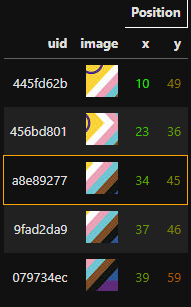

# html_snippets

`html_snippets` is a Python package that provides a collection of functions for generating html snippets for use in Jupyter or possibly webservers like flask.

It is able to work with PIL images including overlays and generate sortable tables.

## Installation

Installation and packaging are work in progress.

## Preview

This is how a table generated with this library might look like:

Please see [example.ipynb](example.ipynb) for more information on how to make advanced use of this library.

## License

This project is licensed under the Apache 2.0 license.